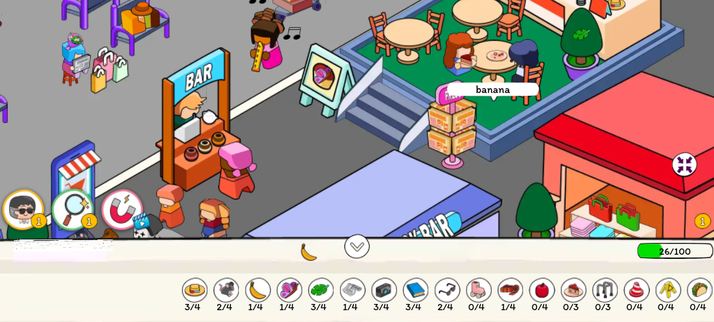

# Деконструкция жанра Hidden Object Game (HOG).

В исследовании были рассмотрени два типа таких игр: 
- игры на поиск разных предметов с ростером предметов внизу экрана.
- игры с поиском одного типа предмета без ростера предметов, с одним счетчиком предметов (поиск котов на картинке)

**Были изучены следующие игры:**

**Поиск 1 типа предметов:**

- `Find The Cat - Spot It!` (бесплатная, Google Play; https://play.google.com/store/apps/details?id=com.ventogames.findthecat)
10 + млн скачиваний
- Hidden Pigeon (бесплатная, Poki)

**Поиск группы предметов:**

- Hidden Folks (платная, Google Play, также есть на Steam; https://play.google.com/store/apps/details?id=com.adriaandejongh.hiddenfolks)
100К скачиваний
- Hidden Objects Games (бесплатная, Google Play; https://play.google.com/store/apps/details?id=com.morionstudio.hiddenobject)
500K скачиваний
- Hidden Objects - The Journey (бесплатная, Google Play; https://play.google.com/store/apps/details?id=games.taplab.thejourney)
10 + млн скачиваний
- Where Is? Find Hidden Objects (бесплатная, Poki)
500,000 игровых сессий

Версия HOG, где есть набор стикеров и их нужно наклеивать на подходящие места не был изучен, хотя и тоже потенциально интересная ниша для реализации.

Также, игры с поиском группы предметов по челленджу для игрока я бы разбил на ещё 2 под-категории: 
- простой цикл обнаружение → тычок → предмет найден
- усложнение обнаружения предмета: предмет полностью скрыт другим предметом, который нужно сдвинуть или как-то провзаимодействовать. Например, нужно ткнуть по урне, она переворачивается, выпадает искомый предмет. Пример игры: Where Is? Find Hidden Objects

Далее, при реализации важно с самого начала принять стратегическое решение: ограничивать ли игрока попытками или дать возможность ошибаться и тыкать в любые области бесконечно. 

Вокруг ограничения попыток можно строить монетизацию, продавать игроку доп. пакеты попыток и прочие бустеры за реварды или реальные деньги. По такому пути идут игры Hidden Objects Game с Google Play,  Hidden Objects - The Journey. Но в чатах разработчиков от геймдизайнеров я слышал, что это плохое решение, ограничивать игрока – вероятно оно плохое для премиальных игр, например игр под Steam. 

- В “Hidden Folks”, которые продаются в Google Play никакого ограничения попыток нет.
- В “Where Is? Find Hidden Objects” на Poki ограничений нет.
- В “Find The Cat - Spot It!” даётся всего 5 попыток (5 жизней).
- В  “Hidden Objects - The Journey” даётся 10 попыток, они очень быстро тратятся, стимулируя игрока посмотреть рекламу, приобрести еще попытки и так далее
- В  “Hidden Objects Games” игроку щедро дается аж 100-200 попыток и также щедро дарятся еще попытки за разные успешные выполнения заданий, выполнения комбо или получение за рекламу.

## Особенности реализации

1. При изучении HOG игр с Google Play, т.е. поддерживающих только мобильную портретную ориентацию были обнаружены следующие размеры уровня в абсолютных единицах (пиксели) для моего устройства:

Размеры уровня

```
w = 1065
h = 1812
```

Разрешение моего устройства (`Oppo Reno Lite 4`)

```
w = 576
h = 1280
```

Соотношение получается следующее:

```
w/ratio = 1.8489
h/ratio = 1.4156
```

Т.е. можно вывести такое соотношение размеров уровня к размеру экрана среднего мобильного устройства – грубо говоря, уровень должен быть чуть меньше 2 полных экранов в ширину и в полтора раза длиннее в  высоту.


Ниже приведен полный уровень, сшитый из 4 скриншотов экрана:


2. Веб-версия. В Веб версии игры уровень размещается по центру, а по краям добавляются декоративные шторки

3. В HOG работает зум для помощи игроку. Можно отдалиться, увидеть большую панораму, но как правило не сильно далеко, весь уровень всё равно не умещается на экран в изученных играх, можно приблизиться, примерно в 1.5 – 2 раза максимум, для поиска мелких предметов.
4. В HOG работает перемещение камеры по уровню посредством свайпа, движение камеры прекращается после отпускания свайпа, т.е. оно без инерции, как например в RTS или Action/RPG на ПК.
5. В некоторых играх на поиск разных типов предметов нижнюю панель с ростером предметов можно скрыть, увеличив видимую область уровня для игрока.
6. В помощь игроку даются разные power-up-ы. Были обнаружены 3 разных типа power-up-ов:
- лупа – находит случайный предмет для игрока, визуально выделяет его (яркая рамочка, затенение всей области вокруг, возможна мягкая анимация)
- магнит – появляется в случайном месте уровня и притягивает к себе сразу несколько предметов (2-4), открывая для игрока таким образом сразу группу предметов за 1 применение. В некоторых играх он доступен сразу (за просмотр реварда). В “Where Is? Find Hidden Objects” на Poki фича открывается только после прохождения пары первых уровней, а изначально доступна только лупа.
- компас. На уровне появляется компас с красной стрелкой-указателем, ведущей игрока к случайному предмету, после того, как предмет найден и выбран, компас выбирает следующий и снова стрелкой указывает игроку направление, помогая найти его на карте и тыкнуть.
Здесь наблюдается интересное расхождение в реализации. Я увидел 2 разные реализации:

1. компас с количеством подсказок. В “Where Is? Find Hidden Objects” на Poki он подсказывает всего 1 раз, но в теории для своей игры, вполне можно увеличить количество подсказок до 2-3. Весьма странная реализация, т.к. по сути, power-up для меня  как игрока концептуально ничем не отличается от лупы, скорее я бы просто тогда чаще применял лупу – это проще и быстрее.
2. компас с таймером. Было подмечено у игры “Hidden Objects - The Journey”. Мне больше всего понравилось, как это сделано в этой игре. Суть в том, что на уровне также появляется компас-помощник с таймером на 10 секунд, таким образом дающий игроку найти на карте как можно больше предметов, пока действует подсказка-указатель направления. Мне понравилось искать предметы с таким power-up-ом, т.к. это нехило так добавляет азарт эффективнее заиспользовать подсказку в очень ограниченное время, хочется находить предметы очень быстро, найти как можно больше, прямо втягивает в игру. Берите на заметку!

Ниже приведен ролик, показывающий весь flow работы фичи компаса с таймером:

Ссылка на [Google.Disk](https://drive.google.com/file/d/17rJ9oCwhTOw6WpVSrONrrsYmuu3yn2me/view?usp=sharing)

## Монетизация

1. В играх есть interstitial реклама между уровнями
2. Также очень агресивная и частая реклама используется в “Hidden Objects - The Journey”. Придумана интересная, но лично для меня как игрока, раздражающая и даже фрустрирующая схема, как удерживать игрока в игре, но при этом продолжать показывать рекламу даже посередине прохождения непосредственно уровня.

В самом первом уровне игроку нужно найти 60 предметов. По мере прохождения, игра делает отсечки, когда остается найти 26, 11, 7 и 1 предмет. Во всех этих моментах игра выдает подбадривающий диалог игроку с похвалой и призывом продолжать ещё с единственной кнопкой “Продолжить”. По закрытии диалога происходит прерывание игрового процесса на показ Interstitial рекламы. Таким образом, аж 4 показа рекламы на один уровень!
3. Power-up-ы (бустеры) можно приобрести за просмотр rewarded. Также, наборы поверапов и дополнительные наборы попыток можно приобрести за реальные деньги. Пример экранов магазинов из 2-ух игр ниже.

## Визуальные эффекты, flow поиска

### Правильно найденный предмет
При нахождении и нажатии по предмету происходит следующее:
1. Над предметом появляется короткий информационный GUI - небольшая карточка либо баббл, в нем есть как правило название предмета. В “Hidden Objects - The Journey” - это оформлено как квадратный бабл с иконкой предмета, а также с информацией, сколько уже собрано предметов из нужного. 
 
   См. скрин ниже:
    
    
2. Сам предмет совершает анимацию движения в свою соответствующую иконку-карточку в нижнюю полоску с ростером предметов. При этом во всех играх ростер предметов реализован как горизонтальный однострочный грид. И если иконка найденного предмета находится за экраном, грид скроллится в нужную сторону, чтобы отобразить нужную иконку. Таким образом предмет долетает в эту икону и исчезает, либо с эффектами (Vfx, партиклы, облачко) либо просто без эффектов.
3. GUI обновляет свой вид: обновляется счетчик иконки для данного типа предмета. Обновляется общий прогресс бар всех предметов (если есть в GUI игры)
4. Есть звуки найденного предмета - при нажатии короткий звук (например, pop, пуньк, т.е. не раздражающий, а максимально приятный), это дополнительный аудио-фидбек к визуальному
5. На мобильных устройствах также присутствует вибро-отдача
6. Дополнительно, в некоторых играх игрока "вознаграждают" доп надписями на уровне - показываются яркие баблы с сообщениями Combo x2, Combo x3, Bravo etc., если игрок совершил серию быстрых обнаружений и подряд натыкал предметы, не мисскликнув мимо.

Ниже приведены ещё 2 варианта отображения GUI найденного предмета:

1. Where Is? Find Hidden Objects (Poki)
   
    
    
2. Hidden Objects Games

    

### Миссклик

При тычке мимо предметов, то есть просто в пустую область уровния или в предмет декорации, который не является искомым происходит следующее:

1. Отображается иконка красного крестика, либо вспышки, 4-конечная белая яркая звезда, вариации см. ниже на GIF-анимациях
2. Опционально проигрывается короткий звук, обозначающий не попадание в предмет (щёлк, тук, тик)
3. Опционально на мобильных устройствах срабатывает короткий вибро-отклик
4. Обновляется GUI игры, элементы, отобрающие жизни / оставшиеся попытки - счётчик меняет значение минусуя одну попытку. С анимациями (например, пульсирование, изменение цвета, затем возврат к ориг. цвету) меняется UI счетчика. Например панель счетчика или сама иконка счетчика краснеет на 0.2 - 0.5 сек.

GIF-анимации мисскликов:

1. "Hidden Objects - The Journey"
   
2. "Hidden Objects Games"
   

## Звуки и музыка
В играх HOG играет спокойная, не высокоритмичная музыка. Из стилей играет например: джаз, пианино.

**Примеры:**

> **(только для ознакомления, не используйте в коммерческих проектах или своих играх!!!)**

1. [Hidden Objects Games](https://drive.google.com/file/d/1xn_HDnK-x3REIRyVPTZ11NpxAXCx1x-5/view?usp=sharing)
2. [Hidden Objects - The Journey](https://drive.google.com/file/d/1p-MBfKsjd4SmcywULm2WQUx5JUPIJcZM/view?usp=sharing)

Можно попрбовать такие теги и ключевые слова, если пытаться генерировать музыку промтами через Suno: `jazz`, `soothing`, `earworm`, `chill`, `cozy`, `relaxing`.

## Технические аспекты
Обработка области тычка предмета реализована простейшим образом в случае "Where Is? Find Hidden Objects (Poki)":
Видно, что вокруг предметов есть проста форма коллайдера - либо круг, либо квадрат с внушительным запасом, можно тыкнуть совсем вне границ предмета, и он будет засчитан.

То есть коллайдер подобран с запасом, но не слишком огромным, в разумных пределах. См. ниже примерно обрисованный коллайдер вокруг фотоаппарата на уровне.

   

Тоже самое было обнаружено и в мобильной игре "Hidden Objects - The Journey". См. пруф гифку ниже (белый кружок - тач игрока):

   

Теоретически, возможно составление сложной формы высчитывая программно в игре границы предмета. Также можно составлять сложную форму из примитивов, комбинируя круги и квадраты, повторя примерный силуэт предмета.
Оба этих способы мне видятся затратными и дорогими в реализации.
Мне кажется, вполне может подойти способ с одним коллайдером с запасами по области, перекрывающим предметы, то есть как это сделано в "Where Is? Find Hidden Objects (Poki)". 

## Выводы, гипотезы, мысли от себя
Таким образом, вырисовывается следующая блок-диаграмма принятия ключевых геймдизайнерских решений для проекта в жанре Hidden Objects:


То есть на самом старте проекта важно выбрать, какого типа будет ваша игра для игрока идя по этой диаграмме, сделав 3 ключевых выбора (отмечены нумерованными кружками коричневого цвета на диаграме):
 
1. Поиск 1 типа предмета или ростер предметов
2. Доп челлендж игроку: скрывать ли предметы другими интерактивными предметами или нет
3. Ограничивать ли игрока в попытках. Принятное здесь решение может влиять на построение монетизации в игре.

Делая тот или иной выбор идя сверху-вниз, слева-направо по диаграмме, вы получаете версию уже выпущенных игр-конкурентов, либо можете получить свои оригинальные комбинации. Здесь уже выбор предстоит сделать вам самим. Так как у меня пока нет данных и аналитики, чтобы оценить самый выигрышный вариант.

Могу лишь предположить, что следующий вариант ниже быть хорошим и оптимальным на старте:

1. Поиск ростера предметов
2. Нет челленджа, нет интерактивных предметов, скрывающих полностью другие
3. Ограничение попыток

Альтернативный вариант при маленьких ресурсах, бюджете и времени и как начальный прототип для запуска может быть такой:

1. Поиск ростера предметов
2. Нет челленджа, нет интерактивных предметов, скрывающих полностью другие
3. Без ограничения попыток

Также этот вариант может быть приемлем, если например на платформе не предусмотрены ревардед, ин-аппы, а есть преимущественно только интерстишал и банер реклама. В таком случае, мало смысла ограничивать игрока попытками, так как это будет сложно или нецелесообразно монетизировать.